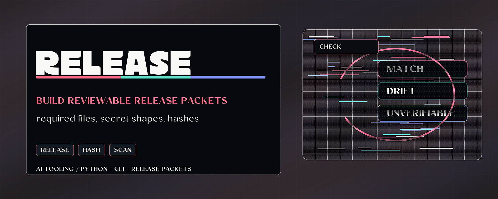

# Release Surface Scanner



> Build a reviewable release packet from required files, secret checks, and hashes.

Release Surface Scanner inspects a repository before public delivery. It checks
required release files, skips private environment files, detects secret-shaped
values without echoing them, hashes included files, and emits JSON or Markdown
release reports.

## Why it matters

Public repos need a repeatable release surface check before they ask anyone to
trust the README, package, or artifact. This tool gives maintainers a compact
packet that can feed proof indexes and release review.

## Try it

```powershell
python -m pip install -e .
release-scan scan . --json-out out/release-report.json --md-out out/release-report.md --fail-on-fail
python -m pytest
```

## What to test first

- Run `release-scan scan .` on the current repo.
- Generate a proof index with `release-scan proof-index .`.
- Confirm `.env` files are skipped and not echoed in reports.

## Current status

Python CLI and library with synthetic fixtures and tests. It is release hygiene
tooling, not a vulnerability scanner or certification system.

## Existing technical notes

> Turn a repo into a reviewable release packet: required files, .env exclusion, secret-shape detection, and per-file hashes.

[](LICENSE)


[](https://github.com/HarperZ9/release-surface-scanner/actions/workflows/tests.yml)

[](https://harperz9.github.io)

It checks required release files, skips private environment files, detects secret-shaped values without echoing them, hashes included files, emits a machine-readable release report, and builds a compact proof index.

## Commands

```powershell
release-scan scan . --json-out out/release-report.json --md-out out/release-report.md --fail-on-fail
release-scan proof-index . --json-out out/proof-index.json
```

## Usage

See [USAGE.md](USAGE.md) for installation, the full CLI/Python surface, worked examples, and expected output. A runnable end-to-end demo lives in [`examples/demo.py`](examples/demo.py).

## Boundary

This package publishes generic release assurance mechanics only. It does not publish private operator data, private evidence, client data, credentials, or `.env` files.

---
**Zain Dana Harper** — small tools with explicit edges.
[Portfolio](https://harperz9.github.io) · [HarperZ9](https://github.com/HarperZ9)
<sub>Built with Claude Code; reviewed, tested, and owned by me.</sub>
